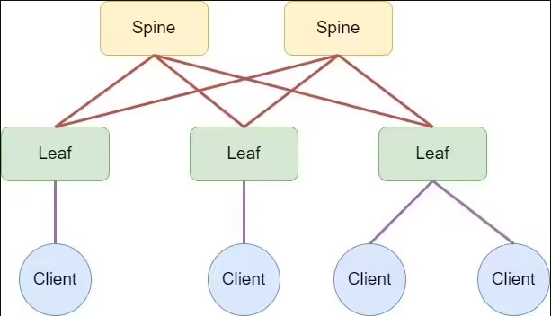
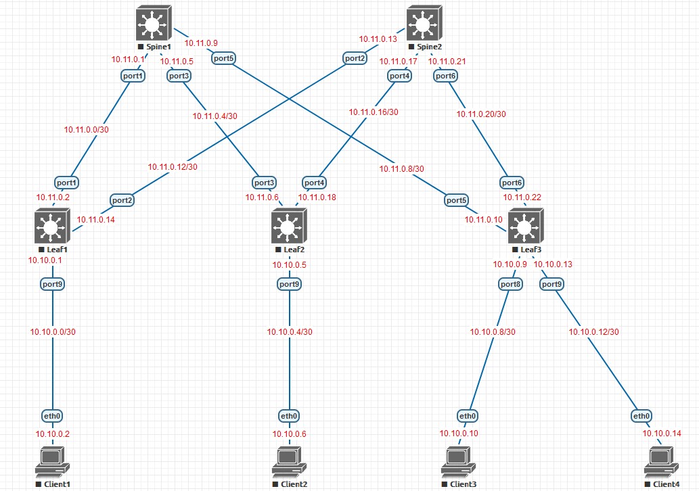

## Дизайн сетей ЦОД
### Первое домашнее задание

### Цели домашнего задания

- 1 Создание топологии согласно схемы приложенной к домашнему заданию
- 2 Распределение адресного пространства для Underlay сети
- 3 Оформить и зафиксировать план работы, адресное пространство, схему сети в файле с разметкой markdown
- 4 Выгрузить созданную документацию в публичный репозиторий на github

#### Схема для создания

#### Схема распределения адресного пространства

|Устройство|Интерфейс|IP адрес|Маска подсети|
|---|---|---|---|
|Spine1|port1|10.11.0.1|255.255.255.252|
|Spine1|port3|10.11.0.5|255.255.255.252|
|Spine1|port5|10.11.0.9|255.255.255.252|
|Spine2|port2|10.11.0.13|255.255.255.252|
|Spine2|port4|10.11.0.17|255.255.255.252|
|Spine2|port6|10.11.0.21|255.255.255.252|
|Leaf1|port1|10.11.0.2|255.255.255.252|
|Leaf1|port2|10.11.0.14|255.255.255.252|
|Leaf1|port9|10.10.0.1|255.255.255.252|
|Leaf2|port3|10.11.0.6|255.255.255.252|
|Leaf2|port4|10.11.0.18|255.255.255.252|
|Leaf2|port9|10.10.0.5|255.255.255.252|
|Leaf3|port5|10.11.0.10|255.255.255.252|
|Leaf3|port6|10.11.0.22|255.255.255.252|
|Leaf3|port8|10.10.0.9|255.255.255.252|
|Leaf3|port9|10.10.0.13|255.255.255.252|
|Client1|eth0|10.10.0.2|255.255.255.252|
|Client2|eth0|10.10.0.6|255.255.255.252|
|Client3|eth0|10.10.0.10|255.255.255.252|
|Client4|eth0|10.10.0.14|255.255.255.252|

#### Топология отображённая инструментами EVE-NG

